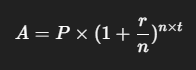
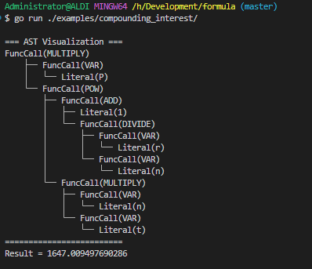

# Compounding Interest

This example shows how to use the formula engine to calculate the compounding interest.

## Formula



Based on the formula above, we can see that the formula is a simple compound interest formula. Then we can translate it like this:

```formula
MULTIPLY(
  VAR('P'), 
  POW(
    ADD(
      1, 
      DIVIDE(
        VAR('r'), 
        VAR('n')
      )
    ), 
    MULTIPLY(
      VAR('n'), 
      VAR('t')
    )
  )
)
```

## Variables

| Variable | Description                                     |
|----------|-------------------------------------------------|
| P        | Principal amount                                |
| r        | Annual interest rate                            |
| n        | Number of times interest is compounded per year |
| t        | Number of years                                 |

## Input

| Variable | Value |
|----------|-------|
| P        | 1000  |
| r        | 0.05  |
| n        | 12    |
| t        | 10    |

```text
P = 1000
r = 0.05
n = 12
t = 10
```

## Result

```bash
go run main.go
```

```bash
Result = 1647.009497690286
```



## Conclusion

We can see that the result is the same as the formula above.
